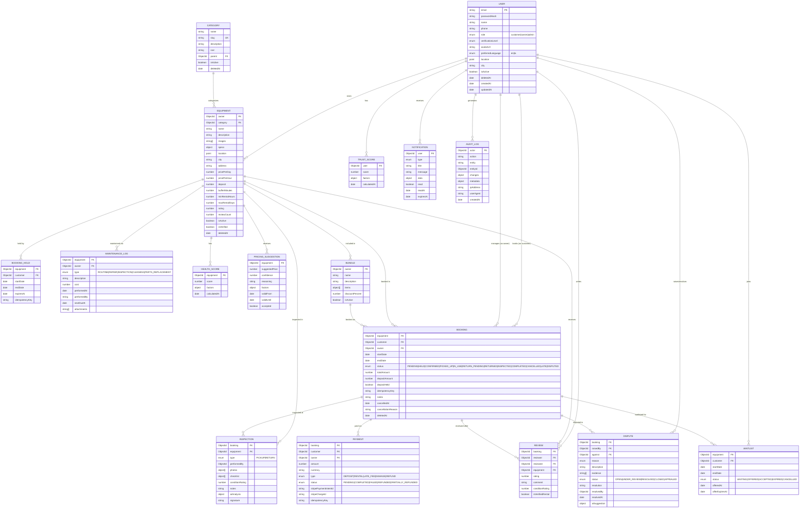

# RentalHub Entity-Relationship Diagram

```mermaid
erDiagram
    USER ||--o{ EQUIPMENT : owns
    USER ||--o{ BOOKING : "books (as customer)"
    USER ||--o{ BOOKING : "manages (as owner)"
    USER ||--o{ REVIEW : writes
    USER ||--o{ TRUST_SCORE : has
    USER ||--o{ NOTIFICATION : receives
    USER ||--o{ DISPUTE : "raises/resolves"
    USER ||--o{ WAITLIST : joins
    USER ||--o{ AUDIT_LOG : generates

    CATEGORY ||--o{ EQUIPMENT : categorizes

    EQUIPMENT ||--o{ BOOKING : "booked in"
    EQUIPMENT ||--o{ BOOKING_HOLD : "held by"
    EQUIPMENT ||--o{ MAINTENANCE_LOG : "maintained via"
    EQUIPMENT ||--o{ INSPECTION : "inspected in"
    EQUIPMENT ||--o{ HEALTH_SCORE : has
    EQUIPMENT ||--o{ PRICING_SUGGESTION : receives
    EQUIPMENT ||--o{ BUNDLE : "included in"
    EQUIPMENT ||--o{ REVIEW : receives

    BOOKING ||--o{ PAYMENT : "paid via"
    BOOKING ||--o{ INSPECTION : "inspected at"
    BOOKING ||--o{ REVIEW : "reviewed after"
    BOOKING ||--o{ DISPUTE : "disputed in"
    BOOKING ||--o{ WAITLIST : "waitlisted for"

    BUNDLE ||--o{ BOOKING : "booked as"

    USER {
        string email PK
        string passwordHash
        string name
        string phone
        enum role "customer|owner|admin"
        enum verificationLevel
        string avatarUrl
        enum preferredLanguage "en|ta"
        point location
        string city
        boolean isActive
        date deletedAt
        date createdAt
        date updatedAt
    }

    CATEGORY {
        string name
        string slug UK
        string description
        string icon
        ObjectId parent FK
        boolean isActive
        date deletedAt
    }

    EQUIPMENT {
        ObjectId owner FK
        ObjectId category FK
        string name
        string description
        string[] images
        object specs
        point location
        string city
        string address
        number pricePerDay
        number pricePerHour
        number deposit
        number bufferMinutes
        number minRentalHours
        number maxRentalDays
        number rating
        number reviewCount
        boolean isActive
        boolean isVerified
        date deletedAt
    }

    BOOKING {
        ObjectId equipment FK
        ObjectId customer FK
        ObjectId owner FK
        date startDate
        date endDate
        enum status "PENDING|HELD|CONFIRMED|PICKED_UP|IN_USE|RETURN_PENDING|RETURNED|INSPECTED|COMPLETED|CANCELLED|LATE|DISPUTED"
        number totalAmount
        number depositAmount
        boolean depositHeld
        string idempotencyKey
        string notes
        date cancelledAt
        string cancellationReason
        date deletedAt
    }

    BOOKING_HOLD {
        ObjectId equipment FK
        ObjectId customer FK
        date startDate
        date endDate
        date expiresAt
        string idempotencyKey
    }

    PAYMENT {
        ObjectId booking FK
        ObjectId customer FK
        ObjectId owner FK
        number amount
        string currency
        enum type "DEPOSIT|RENTAL|LATE_FEE|DAMAGE|REFUND"
        enum status "PENDING|COMPLETED|FAILED|REFUNDED|PARTIALLY_REFUNDED"
        string stripePaymentIntentId
        string stripeChargeId
        string idempotencyKey
    }

    REVIEW {
        ObjectId booking FK
        ObjectId reviewer FK
        ObjectId reviewee FK
        ObjectId equipment FK
        number rating
        string comment
        number conditionRating
        boolean isVerifiedRental
    }

    NOTIFICATION {
        ObjectId user FK
        enum type
        string title
        string message
        object data
        boolean read
        date readAt
        date expiresAt
    }

    MAINTENANCE_LOG {
        ObjectId equipment FK
        ObjectId owner FK
        enum type "ROUTINE|REPAIR|INSPECTION|CLEANING|PARTS_REPLACEMENT"
        string description
        number cost
        date performedAt
        string performedBy
        date nextDueAt
        string[] attachments
    }

    INSPECTION {
        ObjectId booking FK
        ObjectId equipment FK
        enum type "PICKUP|RETURN"
        ObjectId performedBy
        object[] photos
        object[] checklist
        number conditionRating
        string notes
        object aiAnalysis
        string signature
    }

    DISPUTE {
        ObjectId booking FK
        ObjectId raisedBy FK
        ObjectId against FK
        enum reason
        string description
        string[] evidence
        enum status "OPEN|UNDER_REVIEW|RESOLVED|CLOSED|APPEALED"
        string resolution
        ObjectId resolvedBy
        date resolvedAt
        object aiSuggestion
    }

    WAITLIST {
        ObjectId equipment FK
        ObjectId customer FK
        date startDate
        date endDate
        enum status "WAITING|OFFERED|ACCEPTED|EXPIRED|CANCELLED"
        date offeredAt
        date offerExpiresAt
    }

    BUNDLE {
        ObjectId owner FK
        string name
        string description
        object[] items
        number discountPercent
        boolean isActive
    }

    TRUST_SCORE {
        ObjectId user FK
        number score
        object factors
        date calculatedAt
    }

    HEALTH_SCORE {
        ObjectId equipment FK
        number score
        object factors
        date calculatedAt
    }

    PRICING_SUGGESTION {
        ObjectId equipment FK
        number suggestedPrice
        number confidence
        string reasoning
        object factors
        date validFrom
        date validUntil
        boolean accepted
    }

    AUDIT_LOG {
        ObjectId actor FK
        string action
        string entity
        ObjectId entityId
        object changes
        object metadata
        string ipAddress
        string userAgent
        date createdAt
    }
```
